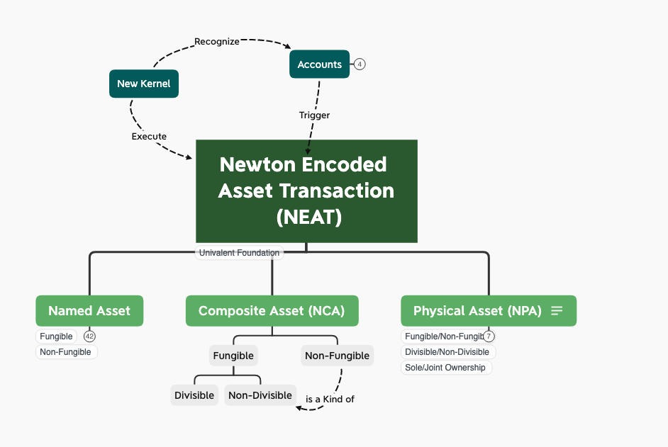
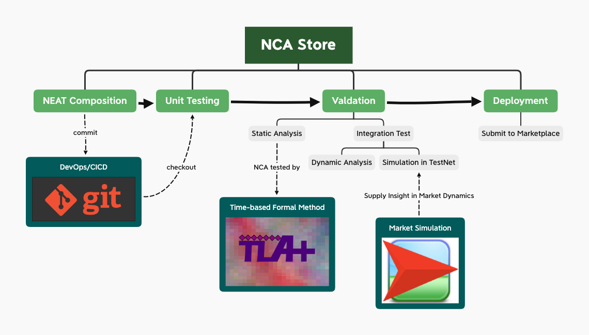
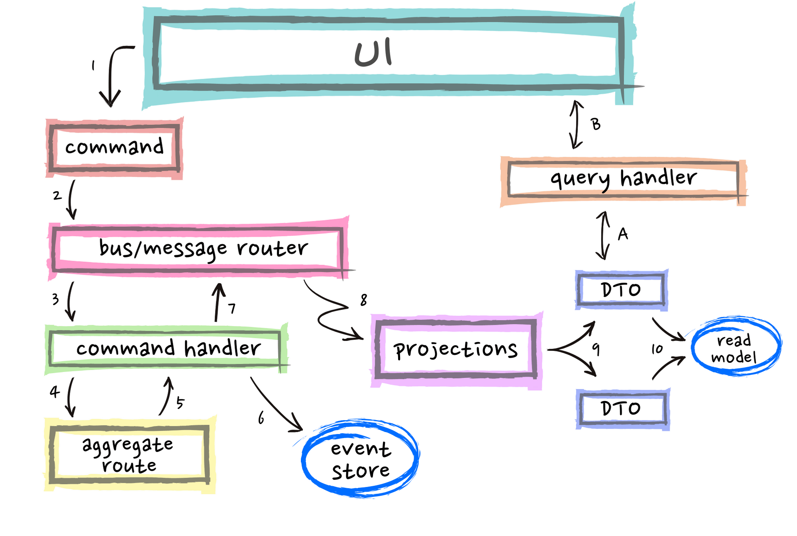

## Simple Summary

Newton Composite Asset (NCA) is the base pattern of asset combination that defines the boundary of how two or more than two assets are combined as a single instance. NCA distinguishes from the other types of asset by involving more than one NEAT. Every NCA is defined based on the principle of Behavioral Equivalence[1](#ref-1), so that unique properties of NCA can be distinguished computationally and therefore maximize the possibility of code reuse and automated asset valuation.

NCA creates value through patterns of asset composition. By definition of composition, every NCA is a combination of two or more than two NEATs. The required engineering of how combined NEATs can generate more value than their independent existence, a package that is more than the sum of its parts, is a major source for its value creation. Economically speaking, if components of an NCA can be bought or sold separately as independent NEATs, there would be little necessity to bundle them together as an NCA. Therefore, it is the compositional pattern that defines the unique value of the system as a collective makes an NCA more valuable than the sum of its parts. Effectively, NCA is the programmable device to define NEAT Portfolios. From a practical standpoint, NCA is where value can be created via combinatorial possibilities, when validated by marketplace, is a true form of productivity. In general, all NCA are uniquely prescribed by the content of its portfolio. When the portfolio contains any one item that is non-fungible, the portfolio are considered to be a Non-Fungible NCA. If the NCA are composed of assets that are all replaceable, then, the NCA is considered to be Fungible NCA. Furthermore, when NCA can be broken up to divisible portions, they are considered to be Divisible NCA. When they must be sold in complete packages, they are considered to be Non-Divisible.

## Abstract

Newton Composite Asset (NCA) is an asset class that defines value through a composition of more than one NEAT components. NCA is the generic data type to define "smart contracts" in Newton Infrastructure, where economical vehicles can be created out of other existing NEAT-based components. It is equivalent to a program composed of many transactional functions that already existed in the trust-worthy platform.   

## Motivation

In contrast to individual NEAT, NCA is composed of multiple NEATs, whose validation and execution of composed transactions must take extra efforts and maintain. Therefore, the value of an NCA should be greater than the sum of its parts. This is also considered to be the way Newton Community can create new value by defining various ways to combine existing sub-classes of NEATs to create new asset classes combinatorially. This is the place where new value can be generated by having creative minded agents and agencies to select meaningful composition of assets, and perform analysis of their combined values. Then, it is up to the creator of the NCA to programmatically define the price and conditions of transaction of all available NEATs across the Newton Community. This allows any agents or agencies in the Newton Community members to contribute their creativity in terms of how to combine NEATs into NCAs.

It is well-known that assets have different values in different spatial and temporal contexts. In most well-known marketplaces, goods and services are often sold when needs arise. The realization of value is often passive. For example, the price of umbrella is often more valuable during rainy days, medical equipments can become particularly valuable when certain diseases become a major threat. These contextual valuation is often realized passively, when event arises. However, such pricing approach not only could cause unreasonable price gauging, in most cases, the supply of goods and services could often be incompatible with the actual needs. Since many of these time-based needs can be overlooked in "normal days". NCA provides a vehicle to combine resources in a time-bound transaction. Therefore, many of these time-based transactions can be planned ahead of time. So that foreseeable needs can be planned ahead of time in the process of designing NCA. In theory, when needs are anticipated before needs arises, the pricing of needed goods and services would naturally consider the issue of supply chain capability. Therefore, there would be relevant efforts to fulfill the needs as anticipated. In practice, when certain needs repeatedly occur, new classes of NCA would be created as the community learns about the needs in reality. Therefore, the overall community would become more capable in reaching reasonable supply and demand dynamics.

### Asset Valuation Techniques

Analyzing the values of NCA requires a new breed of simulation tools. Since the market value of asset is bounded to a societal context, and the future of this realistic context always have certain uncertainty. The best possible approach is to provide a common Asset Valuation Simulation platform, so that the value of any NCA will be priced based on the simulation, with participant's private investments or insurance policies.

### User Experience Design of NCA
NCA's user interface should have a common base-design. Since all NCA are made of other instances of NEAT-based assets, a common navigation interface must be provided for all NCA. So that user would have a consistent experience in identifying and comparing NCAs.   

### Immutability and irrefutability
Every NCA is a unique combination of NEAT assets. So that once it is created, the compositional content cannot be changed.

### NCA's names in NEAT Namespace
NCA can be represented as a registered name in NEAT's namespace. It should be a subclass of NEAT, having its sub-Namespace code segment. This unification of NCA in NEAT will significantly reduce the complexity of NCA management.

## Specification

As mentioned in [NEAT](nep-20.md), the foundational building blocks of NCA is NEAT. The composition of NEAT into NCA is based on pi-Calculus. Every NCA is defined as follows:

<pre><code>
NCA, NEAT :=   
                                    Receive asset *a* from Transaction Channel *C*,  run NEAT or NCA;  
                                    Send asset *a* over Transaction Channel *C*, then, run NEAT or NCA;
                                    Concurrently Execute NEAT and NCA, and test NCA's composition rules;
                                    Create a new Transaction Channle *X*, run NCA;
                                    Repeat multiple instances of NCA or NEAT;
                                    Terminate all NCA and NEAT transactions;
</code></pre>

### Syntax and Semantics
NCA is a composite data structure defined by NEATs or other instances of NCA. As shown above, NCA can be defined recursively. The legitimacy of NCA is defined by the temporal and logical prescription of each NEAT, for example, if certain assets requires the concurrent availability of other collateral assets, such as meat delivery must be accompanied by refrigeration service, then, relevant temporal logic conditions must be satisfied. By embedding logical and temporal conditions within each NCA, the NCA composition is the executable logic that defines whether certain contract is considered fulfilled or breached. NCA can be composed of any number of existing NEATs. For example, it can be a combination of existing NPA (Physical Assets), NBC (Newton-backed Currencies), and NPC (Newton Prepaid-Card). By specifying the asset components of an NCA, it also automatically check the temporal and logical validity of these composited asset, so that all transactions are automatically verified statitically, and dynamically, based on a common data type, NEAT.

A unique feature of NCA is the creator. Since every NCA spells out a unique composition of asset content, its creator is like an artist/author, that creates a unique portfolio of assets. Therefore, the account, or accounts that create such composition, should be associated with this value creation process, and should be responsible for the rewards and possible damages of this value composition.

### Meta Data

| Item | Description | Behaviors/Properties |
|:-|:-|:-|
| **Creation Input** |
| Creator Accounts | The Newton Account identities that creates the said NCA | deploy/can not be changed |
| Associated NEATs | A list of NEAT involved with this NCA | at least one NEAT |
| Portfolio Rules | A composition that describes the quantity and sequence of NEAT/NCA | rule should be described in pi-Calculus |
| Status | The status of NCA is can be separated into following kinds: Proposed, Tested, Verified, Executed, Decommissioned | a finite set of status classes |
| ** Evolution History ** |
| Developmental History | A list of time points when NCA is created and modified | new timestamps are added as changes made |
| Execution History | A list of NCA execution time points, including reference to executed NCAs | immutable data records |

## Rationale
NCA is a way to leverage compositional efforts to create value. Such compositional value creation can be best illustrated by Bitcoin as a currency. Since Bitcoin as a system creates market value through a composition of three communities, they are:

1. A community of Miners: a large number of administratively independent machines, that agrees on a common transaction ledger.
2. A community of Traders: a large number of accounts and agents who are transferring funds between different accounts.
3. A community of Coders: an open sourced community that keeps improving and fixing source code the offers better and more secure software functionalities.

The value of NCA comes from its composition of complementary functions. Separately, each community has relatively limited value constrained by their physical surroundings. Once combined through Bitcoin, or some form of NCA, the credibility of assets and ubiquity of asset liquidity becomes pervasive. Effectively, this three way composition of Miner, Traders, and Coder accounts, brings together a living entity that is distributed across the globe, and works around the clock, unstoppably. Similarly, there will be many forms of assets that can be composed to broaden its value across space and time. The role of NCA as a root class of other NCAs, is to provide a template the covers how asset valuation can be done, how to design user interfaces for other NCAs, and demonstrate the immutable and irrefutable values of assets. Last but not least, the value in Namespace, is the foundation of asset management, and how NCA plays in the Namespace must abide to a set of non-negotiable rules.

## High Level Architecture

NCA is essentially a composed NEAT contract that needs the widest possible reachability to the marketplace. For NCA to exists, it must first be created. The creation process should follow the typical DevOps/CI/CD type development cycle. The DevOps/CICD workflow is often associated with the idea of Event Sourcing, short handed as ES. For trivial combination of NEATs, simple user interface that allows users to combine NEATs into portfolio of NEATs would be a starting point. Once any NCA is created with existing NEATs, a sequence of testing and validation procedure must be applied, so that programmatically detectable conflicts can be first conducted before the created NCA is released to the marketplace.

 It can be thought of as a typical exchange matching engine, when the ask/bid combinations are matched, the transaction would take place. In short, it can be simply considered as a marketplace of NCAs, and they can be bought and sold as if they are listed entries of stock or futures in current market practice. Knowing the transactional nature of NCA, the design of NCA exchange marketplace can be implemented using the existing exchange engine that is commonly designed to execute stock or virtual currency trades. As mentioned earlier, the buyer/seller matching algorithm should be based on some automated algorithms. These algorithms should following the Behavioral Equivalence[1](#ref-1) properties. One way to defining such property is to classify NCAs that are ready to be exchanged in terms of Behavioral Equivalences. So that all transactions can automatically take place based on the pre-processed classification.

 A rather complete architectural diagram based on CQRS-architectural pattern could be referenced to implement the overall system. The diagram was originally created to explain the CQRS-Event Sourcing concept by [Daniel Whittaker](https://danielwhittaker.me/2020/02/20/cqrs-step-step-guide-flow-typical-application/).
 

## Implementation

There are two aspects of NCA implementation. The first one is NCA creation by combining NEATs. The second one is to release NCAs into a public marketplace to be traded. The first one should be an exercise of user interface design and automated testing. As mentioned in the High Level Architecture, the automated testing should follow priniciples prescribed by [1] Behaviral Equivalence of said NCAs. The testing can be conducted using formal model checking tools such as TLA+ or to be implemented in Coq.

The second one is a matching engine that allows traders to quickly search for their desirable NCAs and allow buyers and sellers to easily find their targets. The implementation of matching and transactional engine can be implemented using Event Sourcing and CQRS-based implementation models. For the choice of software stack, Apache-Kafka is a high performance platform that can execute up to millions of transactions per second.

## References

1. Rocco De Nicola, Behavioral Equivalences, [[Research Gate](https://www.researchgate.net/publication/266867223_Behavioral_Equivalences)], [[L-Università ta' Malta](http://staff.um.edu.mt/afra1/seminar/de-nic-beh-eq.pdf)]

2. [Alex Pentland, Alexander Lipton, and Thomas Hardjono, Building the New Economy](https://wip.mitpress.mit.edu/new-economy), [MIT Press]

## Copyright
Copyright and related rights waived via [CC BY-SA 4.0](https://creativecommons.org/licenses/by-sa/4.0/).
